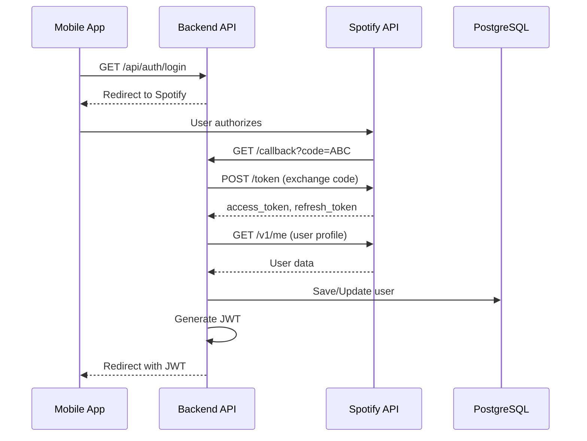
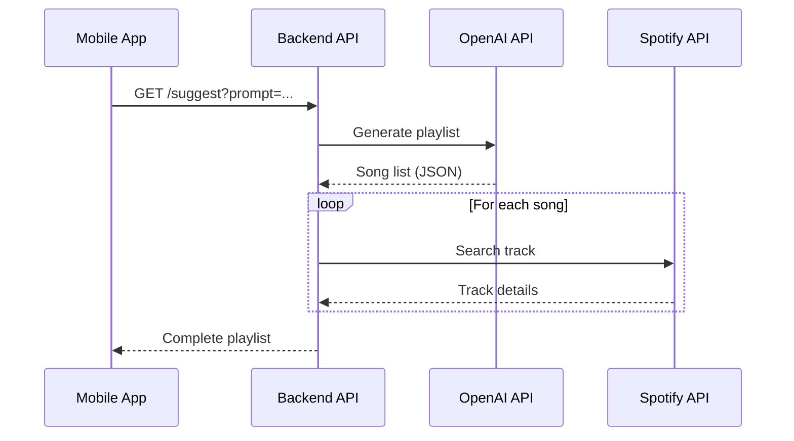

# 🎵 Postify Backend

> AI-powered Spotify playlist generator API built with .NET 8

## 🎯 Overview

Postify Backend is a RESTful API that integrates Spotify Web API and OpenAI to generate personalized music playlists. It handles OAuth authentication, AI-powered playlist generation, and Spotify account integration.

---

## ✨ Features

- 🔐 **Spotify OAuth 2.0** - Secure user authentication with authorization code flow
- 🤖 **OpenAI Integration** - GPT-4o-mini for intelligent playlist generation
- 🎵 **Spotify Web API** - Search tracks, create playlists, manage user library
- 🔑 **JWT Authentication** - Secure API authorization with custom claims
- 💾 **PostgreSQL Database** - Persistent user and token storage
- 🏗️ **Clean Architecture** - Repository pattern, dependency injection, SOLID principles

---

## 🛠️ Tech Stack

| Technology | Version | Purpose |
|-----------|---------|---------|
| .NET | 8.0 | Web API framework |
| Entity Framework Core | 8.0 | ORM and database migrations |
| PostgreSQL | 15+ | Relational database |
| JWT Bearer | 8.0 | API authentication |
| OpenAI API | GPT-4o-mini | AI playlist generation |
| Spotify Web API | v1 | Music data and playlist management |

---

## 🏗️ Architecture

### Authentication Flow

### Playlist Generation Flow

## 📊 Performance Considerations

### Spotify API Rate Limits

- **Search API:** 180 requests per minute per user
- **Playlist Creation:** 300 requests per minute

**Recommendation:** Implement caching for search results

### OpenAI API Costs

- **GPT-4o-mini:** ~$0.15 per 1M input tokens
- Average playlist generation: ~500 tokens (~$0.0001 per request)

---

- [Spotify Web API Documentation](https://developer.spotify.com/documentation/web-api)
- [OpenAI API Reference](https://platform.openai.com/docs/api-reference)
- [.NET 8 Documentation](https://learn.microsoft.com/en-us/dotnet/)
- [Entity Framework Core](https://learn.microsoft.com/en-us/ef/core/)
- [JWT Best Practices](https://tools.ietf.org/html/rfc8725)

---

## 📞 Support

For issues or questions about this project, please create an issue in the repository.
